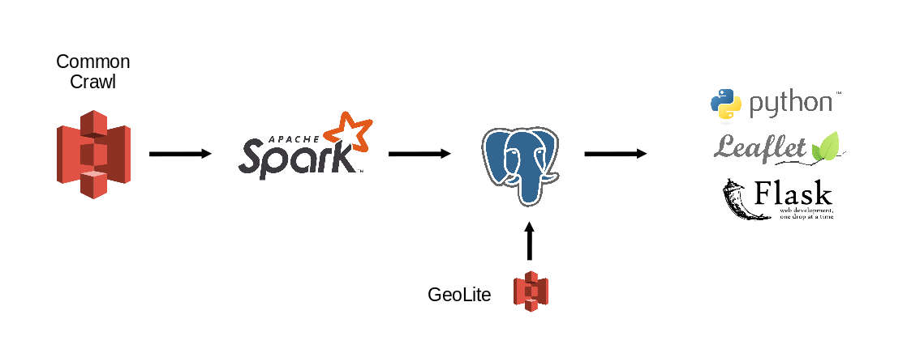

## Secure Internet Communications and the Web Servers Behind It
### Jose L Garcia
### January, 2020

* This project is aimed to show a world map with the general location of websites using http communications, compared to the websites using https.

* It also aggregates the data to show market share of internet servers across countries.

* The proposed data pipeline uses Spark to parse the files stored in the Common Crawl repository and extract basic infomation such as Domain, IP Address, Webserver. These IP Addresses are joined with the Geolite dataset into a PostgreSQL database.

* The results are presented in a heatmap showing general locations of webpages among other data.

 
